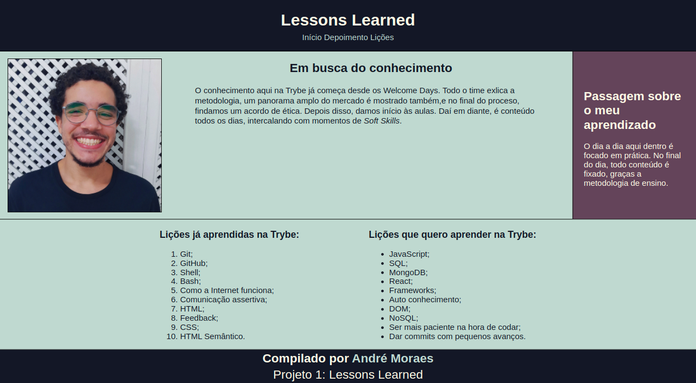

# Projeto Lessons Learned

Neste projeto, nós criamos um site que contém informações gerais sobre o dia a dia na Trybe e as lições que aqui aprendemos e as que ainda aprenderemos.

Para isso, o site foi desenvolvido com HTML e CSS.

---

# Habilidades

- Utilizar HTML para construir páginas WEB;

- Utilizar HTML semântico para tornar sua página mais acessível e melhor ranqueada;

- Utilizar CSS para adicionar estilo e posicionar elementos.

---

## Requisitos

Ao todo, incluindo o bônus, foram 15 requisitos:

#### 1. Adicione uma cor de fundo específica para a página;

#### 2. Adicione uma barra superior com um título;

#### 3. Adicione uma foto sua à página;

#### 4. Adicione uma lista de lições aprendidas à página;

#### 5. Crie uma lista de lições que ainda deseja aprender para a página;

#### 6. Adicione um rodapé para a página;

#### 7. Insira pelo menos um link externo na página;

#### 8. Crie um artigo sobre seu aprendizado;

#### 9. Crie uma seção que conta uma passagem sobre seu aprendizado;

#### 10. Aplique elementos HTML de acordo com o sentido e propósito de cada um deles;

#### 11. Teste a semântica da sua página está aprovada pelo site CodeSniffer;

## Bônus

#### 12. Adicione uma tabela à página;

#### 13. Utilize o Box model;

#### 14. Altere atributos relacionados as fontes;

#### 15. Posicione o seu artigo e a seção sobre aprendizados um ao lado do outro.