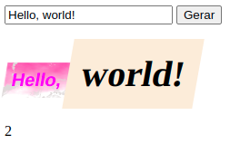

# Projeto Mistery Letter

Neste projeto, nós criamos uma aplicação que gera, aleatoriamente, algumas estilizações para as palavras contidas na frase que o usuário digitar.

Para isso, criamos um arquivo HTML, outro CSS e outro JavaScript.

---

# Habilidades

- Manipular o DOM;

- Manipular o Javascript;

- Manipular o CSS.

---

## Requisitos

Ao todo, incluindo o bônus, foram 18 requisitos. São eles:

#### 1. Deve haver um input com o id="carta-texto" onde a pessoa usuária poderá digitar o conteúdo da carta;

#### 2. Deve haver um parágrafo com o id="carta-gerada" onde a pessoa usuária verá o resultado de sua carta misteriosa;

#### 3. Deve haver um botão com id="criar-carta" e ao clicar nesse botão, a carta misteriosa deve ser gerada;

#### 4. Ao criar uma carta através do botão com id="criar-carta", o input com id="carta-texto" deve permanecer com o texto digitado;

#### 5. Se a pessoa usuária não preencher o campo ou preencher com apenas espaços vazios adicionar a mensagem 'Por favor, digite o conteúdo da carta.';

#### 6. Crie a classe newspaper;

#### 7. Crie a classe magazine1;

#### 8. Crie a classe magazine2;

#### 9. Crie a classe medium;

#### 10. Crie a classe big;

#### 11. Crie a classe reallybig;

#### 12. Crie a classe rotateleft;

#### 13. Crie a classe rotateright;

#### 14. Crie a classe skewleft;

#### 15. Crie a classe skewright;

#### 16. Adicione as classes de forma aleatória a fim de estilizar as palavras.

## Bônus

#### 17. Com uma carta misteriosa gerada, adicione a possibilidade de alterar o estilo de uma palavra específica ao clicar nela;

#### 18. Deve haver um parágrafo com o id="carta-contador" onde existirá um contador de palavras.