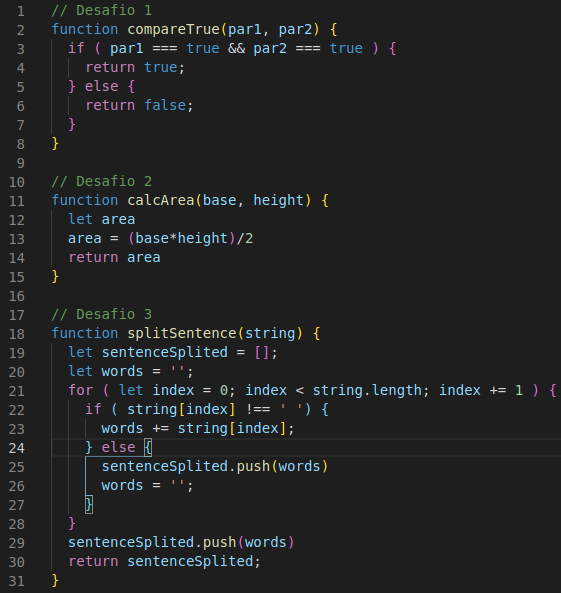

# Projeto Playground Functions

Neste projeto, nós implementamos algumas funções em JavaScript, de acordo com o que era explicitado no requisito.

Para isso, criamos dois arquivos JavaScript: um para os requisitos obrigatórios (challenges.js) e outro para os requisitos bônus (challenges2.js).

---

# Habilidades

- Escrever códigos em JavaScript que usam variáveis e tipos primitivos;

- Utilizar conceitos da linguagem como a tipagem dinâmica e operadores lógicos/aritméticos/de atribuição no seu código;

- Criar códigos que usam estruturas condicionais, como o if/else ;
Manipular arrays (listas);

- Utilizar o comando for ;

- Quebrar grandes problemas em pequenos;

- Utilizar a lógica de programação na resolução de problemas;

- Manipular objetos;

- Utilizar o comando for/in ;

- Utilizar funções para organizar e estruturar o seu código.

---

## Requisitos

Ao todo, incluindo o bônus, foram 13 requisitos. São eles:

#### 1. Crie uma função usando o operador &&;

#### 2. Crie uma função que calcule a área de um triângulo;

#### 3. Crie uma função que divida a frase;

#### 4. Crie uma função que use concatenação de strings;

#### 5. Crie uma função que calcule a quantidade de pontos no futebol;

#### 6. Crie uma função que calcule a repetição do maior número;

#### 7. Crie uma função de Caça ao Rato;

#### 8. Crie uma função FizzBuzz;

#### 9. Crie uma função que Codifique e Decodifique;

#### 10. Crie uma função de Lista de Tecnologias.

## Bônus

#### 11. Crie uma função de Número de Telefone;

#### 12. Crie uma função de Condição de existência de um triângulo;

#### 13. Crie uma função de boas vindas ao Bar da Trybe!
