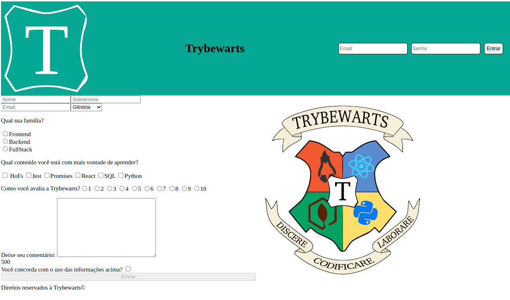

# Projeto TrybeWarts

Neste projeto, nós criamos uma forma de cadastro em uma escola de bruxo, inspirada em uma saga de bruxos muito famosa. Além de fornecer algumas informações pessoais, também é possível deixar um comentário e fazer com que todas as informações fiquem salvas, ao concordar com os termos e enviar o formulário.

Para isso, criamos um arquivo HTML, outro CSS e outro JavaScript.

---

# Habilidades

- Criar formulários em HTML;

- Utilizar CSS Flexbox para criar layouts flexíveis;

- Criar regras CSS específicas para serem aplicadas a dispositivos móveis;

- Construir páginas que alteram o seu layout de acordo com a orientação da tela.

---

## Requisitos

Ao todo, incluindo o bônus, foram 21 requisitos. São eles:

#### 1. Crie uma barra verde na parte superior da página;

#### 2. Adicione o logotipo da Trybewarts com a classe trybewarts-header-logo na barra superior;

#### 3. Acrescente um formulário de login no canto direito da barra superior contendo os inputs de email, senha e um botão de login;

#### 4. Crie um título com o texto Trybewarts centralizado dentro do Header;

#### 5. Adicione um formulário no corpo da página;

#### 6. Faça com que o eixo principal do formulário seja vertical;

#### 7. Adicione a logo da Trybewarts no lado direito da página;

#### 8. Acrescente ao formulário com id evaluation-form os inputs de nome, sobrenome e email;

#### 9. Acrescente ao formulário um select com o id house contendo as opções Gitnória, Reactpuff, Corvinode e Pytherina;

#### 10. Posicione os campos de Nome e Sobrenome para que fiquem em linha;

#### 11. Posicione os campos de Email e Casa para que fiquem em linha;

#### 12. Acrescente ao formulário um campo de entrada para qual família a pessoa estudante se identifica;

#### 13. Crie campos de entrada do tipo checkbox contendo seis opções;

#### 14. Crie campo de entrada para avaliar de 1 a 10 o nível de satisfação com a Trybewarts;

#### 15. Crie uma textarea com o id textarea e uma label com a classe textarea contendo o número máximo de caracteres igual à 500;

#### 16. Crie um campo de entrada do tipo checkbox com o id agreement para validar as informações;

#### 17. Crie um botão de Enviar para submeter o formulário;

#### 18. Faça com que o botão Enviar seja habilitado somente após a checkbox do requisito 16 ser selecionada;

#### 19. Crie um rodapé no final da página;

## Bônus

#### 20. Crie um contador com o ID counter contendo o número de caracteres disponíveis no textarea, variando de 500 até 0, que deverá ser atualizado a medida que algo for digitado na textarea;

#### 21. Faça com que, ao clicar no botão Enviar, o conteúdo dentro da tag <form> seja substituído pelas informações preenchidas pela pessoa usuária;