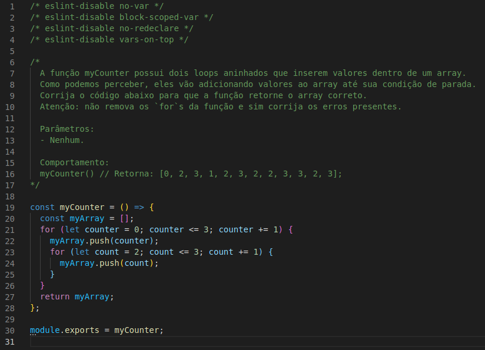

# Projeto Unit Test

Neste projeto, fomos responsáveis hora por implementar funções, hora por implementar o test em Jest que verificava se essa função funcionava de acordo com o que foi projetada e hora fazíamos as duas coisas.

Para isso, implementamos as funções da pasta src, e criamos os testes da pasta test. Todos os testes foram criados no Jest.

---

## Habilidades

Nesse projeto, você será capaz de:

- Escrever testes unitários para funções utilizando o módulo Jest do NodeJS para verificar o correto funcionamento dessas funções;
- A partir de testes já implementados, escrever funções de forma que elas atendam aos testes propostos;
- Escrever testes e funções utilizando uma abordagem de desenvolvimento orientado a testes.

---

## Requisitos

Ao todo foram 10 requisitos:

#### 1. Implemente a função `average`;

#### 2. Implemente os casos de teste para a função `numbers`;

#### 3. Implemente a função `vqv`;

#### 4. Implemente os casos de teste para a função `circle`;

#### 5. Implemente a função `createStudent`;

#### 6. Implemente os casos de teste para a função `productDetails`;

#### 7. Implemente as funções `calculator` e `arrayGenerator`;

#### 8. Implemente a função `myCounter`;

#### 9. Implemente os casos de teste para a função `getCharacter`;

#### 10. Implemente a função `createMenu`, bem como seus casos de teste.