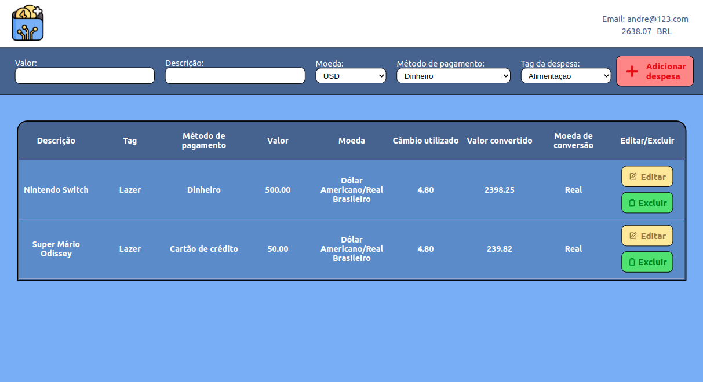

# Projeto Trivia Game

Você deverá desenvolver um jogo de perguntas e respostas baseado no jogo **Trivia** _(tipo um show do milhão americano rs)_ utilizando _React e Redux_, desenvolvendo em grupo suas funcionalidades de acordo com as demandas definidas em um quadro _Kanban_. Confira o Slack para saber como acessar o quadro! Para viver um cenário mais próximo do mercado de trabalho, você deve fazer uma cópia desse quadro para utilizar com seu grupo. É de suma importância que o grupo se organize utilizando o quadro para maior eficiência e para que se minimizem os conflitos que a união de vários códigos trará. A partir dessas demandas, teremos uma aplicação onde a pessoa usuária poderá:

  - Logar no jogo e, se o email tiver cadastro no site [Gravatar](https://pt.gravatar.com/), ter sua foto associada ao perfil da pessoa usuária.
  - Acessar a página referente ao jogo, onde se deverá escolher uma das respostas disponíveis para cada uma das perguntas apresentadas. A resposta deve ser marcada antes do contador de tempo chegar a zero, caso contrário a resposta deverá ser considerada errada.
  - Ser redirecionada, após 5 perguntas respondidas, para a tela de score, onde o texto mostrado depende do número de acertos.
  - Visualizar a página de ranking, se quiser, ao final de cada jogo.
  - Configurar algumas opções para o jogo em uma tela de configuração acessível a partir do cabeçalho do app.

---

# Habilidades

- Criar um store Redux em aplicações React

- Criar reducers no Redux em aplicações React

- Criar actions no Redux em aplicações React

- Criar dispatchers no Redux em aplicações React

- Conectar Redux aos componentes React

- Criar actions assíncronas na sua aplicação React que faz uso de Redux.

---

## Requisitos

  Tela de Login

  #### 1. Crie a tela de login, onde a pessoa que joga deve preencher as informações para iniciar um jogo;

  #### 2. Crie o botão de iniciar o jogo;

  #### 3. Crie um botão que leva a pessoa para tela de configuração.

### Tela de jogo

#### 4. Crie um _header_ que deve conter as informações da pessoa jogadora;

#### 5. Crie a página de jogo que deve conter as informações relacionadas à pergunta;

#### 6. Desenvolva o jogo onde só deve ser possível escolher uma resposta correta por pergunta;

#### 7. Desenvolva o estilo que, ao clicar em uma resposta, a correta deve ficar verde e as incorretas, vermelhas;

#### 8. Desenvolva um timer onde a pessoa que joga tem 30 segundos para responder;

#### 9. Crie o placar com as seguintes características:

  * Você deve salvar a pontuação **atual** no estado no redux na chave player.score;
  * Leia a seção [Observações técnicas](#observações-técnicas) para mais detalhes;
  * Respostas erradas não devem somar ao placar;
  * A fórmula para cálculo dos pontos por pergunta é: `10 + (timer * dificuldade)`, onde timer é o tempo restante no contador de tempo e dificuldade é `hard: 3, medium: 2, easy: 1`, dependendo da pergunta. Exemplo: Se no momento da resposta correta o timer estiver contando 17 segundos, e a dificuldade da pergunta é 2 (média), a pontuação deve ser: `10 + (17 * 2) = 44`.

#### 10. Crie um botão de "Next" que apareça após a resposta ser dada;

#### 11. Desenvolva o jogo de forma que a pessoa que joga deve responder 5 perguntas no total.

### Tela de feedback

#### 12. Desenvolva o header de _feedback_ que deve conter as informações da pessoa jogadora;

#### 13. Crie a mensagem de _feedback_ para ser exibida a pessoa usuária;

#### 14. Exiba as informações relacionadas aos resultados obtidos para a pessoa usuária;

#### 15. Crie a opção para a pessoa jogadora poder jogar novamente;

#### 16. Crie a opção para a pessoa jogadora poder visualizar a tela de _ranking_.

### Tela de ranking

#### 17. Crie um botão para ir ao início;

#### 18. Crie o conteúdo da tela de _ranking_.

## Extra não avaliativo: Tela de configurações

#### 19. Ao mudar o valor do dropdown categoria, apenas perguntas da categoria selecionada devem aparecer para a pessoa que está jogando. Essa configuração será identificada pela chave category no retorno da API;

#### 20. Ao mudar o valor do dropdown dificuldade, apenas perguntas da dificuldade selecionada devem aparecer para a pessoa que está jogando. Essa configuração será identificada pela chave difficulty no retorno da API;

#### 21. Ao mudar o valor do dropdown tipo, apenas perguntas do tipo selecionado devem aparecer para a pessoa que está jogando. Essa configuração será identificada pela chave type no retorno da API.
