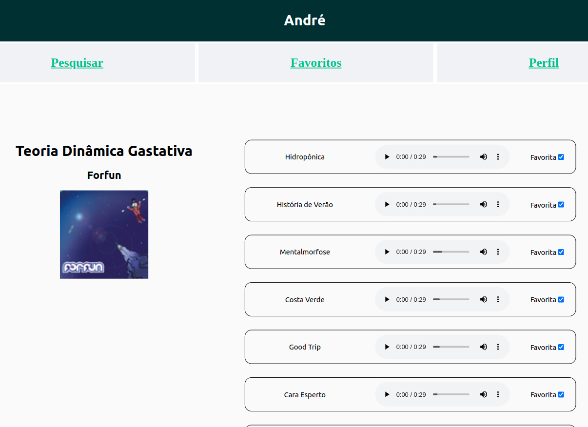

# Projeto Trynfo

Esse projeto foi um dos mais legais de todo o módulo de Front End! Fomos responsáveis por consumir a API do iTunes e, a partir das requisições, buscávamos álbums e exibíamos na tela uma prévia de cada música contida nele. Além disso, criamos também uma aba de músicas favoritas e também uma aba para você personalizar o teu perfil. Foi o primeiro projeto criado a partir do método de Single Page Aplication.

Nesse projeto também percebemos a necessidade de uma nova biblioteca para gerenciar, com facilidade, os estados de uma aplicação React, evitando o _prop drilling_.

Para isso, desenvolvemos uma aplicação com o React, tomando como base um modelo em Figma disponibilizado previamente.

---

# Habilidades

- Fazer requisições e consumir dados vindos de uma `API`;

- Utilizar os ciclos de vida de um componente React;

- Utilizar a função `setState` de forma a garantir que um determinado código só é executado após o estado ser atualizado;

- Utilizar o componente `BrowserRouter` corretamente;

- Criar rotas, mapeando o caminho da URL com o componente correspondente, via `Route`;

- Utilizar o `Switch` do `React Router`;

- Usar o componente `Redirect` pra redirecionar para uma rota específica;

- Criar links de navegação na aplicação com o componente `Link`.

---

## Requisitos

Ao todo, incluindo os requisitos bônus, foram 14 requisitos:

#### 1. Crie as rotas necessárias para a aplicação;

#### 2. Crie um formulário para identificação;

#### 3. Crie um componente de cabeçalho;

#### 4. Crie os links de navegação no cabeçalho;

#### 5. Crie o formulário para pesquisar artistas;

#### 6. Faça a requisição para pesquisar artistas;

#### 7. Crie a lista de músicas do álbum selecionado;

#### 8. Crie o mecanismo para adicionar músicas na lista de músicas favoritas;

#### 9. Faça a requisição para recuperar as músicas favoritas ao entrar na página do Álbum;

#### 10. Faça a requisição para recuperar as músicas favoritas e atualizar a lista após favoritar uma música;

#### 11. Crie o mecanismo para remover músicas na lista de músicas favoritas.

### Bônus

#### 12. Crie a lista de músicas favoritas;

#### 13. Crie a exibição de perfil;

#### 14. Crie o formulário de edição de perfil.