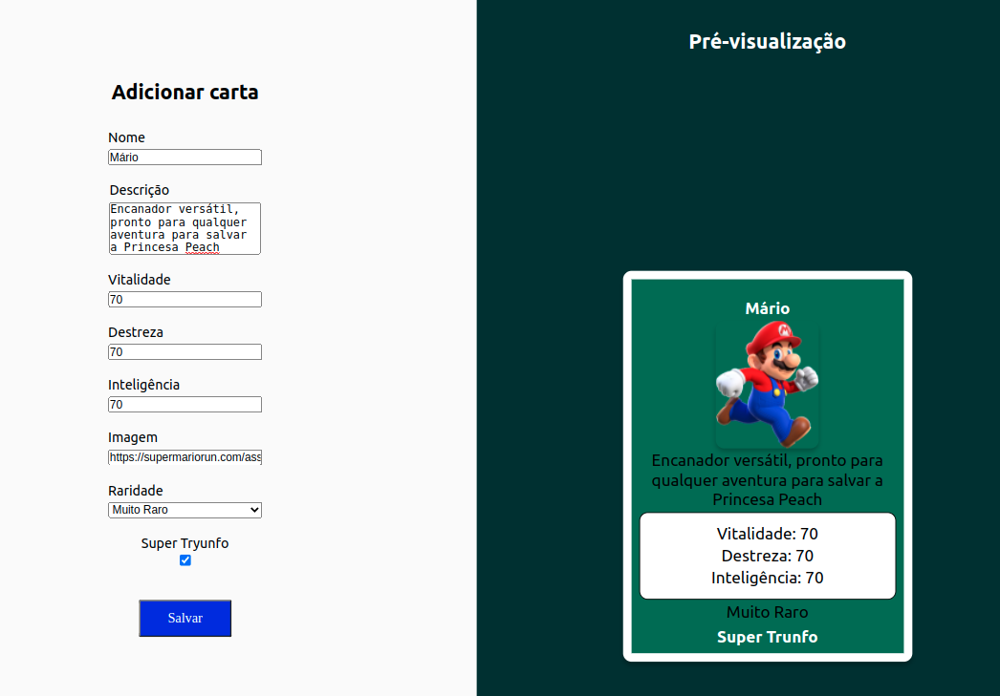

# Projeto Tryunfo

Neste projeto, fomos responsáveis por criar um jogo parecido com o Super Trunfo. A diferença é que podemos criar a carta que quisermos, respeitando sempre as regras de que o deck pode conter apenas um único Super Trunfo e o valor dos requisitos, somados, não podem ultrapassar o valor de 210.

Para isso, desenvolvemos uma aplicação com o React, tomando como base um modelo em Figma disponibilizado previamente.

---

# Habilidades

- Ler o estado de um componente e usá-lo para alterar o que exibimos no browser;

- Inicializar um componente, dando a ele um estado pré-definido;

- Atualizar o estado de um componente;

- Capturar eventos utilizando a sintaxe do React;

- Criar formulários utilizando sintaxe JSX com as tags: `input`, `textarea`, `select`, `form`, `checkbox`;

- Transmitir informações de componentes filhos para componentes pais via callbacks.

---

## Requisitos

Ao todo, incluindo os requisitos bônus, foram 12 requisitos:

#### 1. Crie o formulário que será usado para adicionar cartas ao baralho;

#### 2. Adicione as props necessárias ao componente de formulário;

#### 3. Crie e renderize o componente Card com as props necessárias;

#### 4. Crie o preview da carta que está sendo criada pelo formulário;

#### 5. Faça a validação do botão de Salvar no formulário;

#### 6. Crie a função do botão salvar;

#### 7. Crie a validação do Super Trunfo;

#### 8. Exiba a lista de cartas que estão salvas no estado;

#### 9. Crie um botão para remover uma carta do baralho.

### Bônus

#### 10. Crie o filtro pelo nome da carta;

#### 11. Crie o filtro por raridade da carta;

#### 12. Crie o filtro de Super Trunfo.