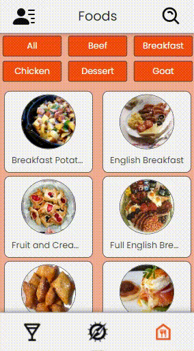
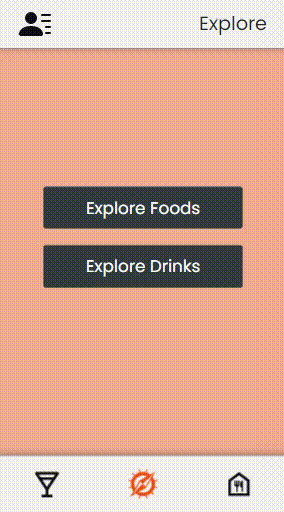

# Projeto Recipe App

  
  

  
  

Este foi o nosso último projeto de Front End. Para formar e nos tornarmos um Desenvolvedor Front End Jr, fomos responsáveis por desenvolver um aplicativo que tem como principal propósito prover algumas receitas para a pessoa usuária. A aplicação foi, inicialmente, desenvolvida para web, com resolução de mobile.

Os dados da aplicação foram providos de duas APIs: uma para as bebidas (https://www.thecocktaildb.com/api.php) e outra para as comidas (https://www.themealdb.com/api.php).

Para explorar de forma completa, a aplicação está hospedada no domínio: <a target="_blank" href="https://tudibao.surge.sh">TudiBão</a>.

Para fins de desenvolvimento, a nossa aplicação foi toda realizada com o React e a nossa equipe optou por utilizar apenas o ContextAPI como ferramenta para gerenciar os estados globais da aplicação.

---

# Habilidades

- Utilizar _Redux_ para gerenciar estado;

- Utilizar a biblioteca _React-Redux_;

- Utilizar a Context API do _React_ para gerenciar estado;

- Utilizar o _React Hook useState_;

- Utilizar o _React Hook useContext_;

- Utilizar o _React Hook useEffect_;

- Criar Hooks customizados.

---

## Requisitos

Ao todo foram 87 requisitos:
  
  

    

      <strong>Desafio 1</strong>
    

    1. Crie um banco com o nome de **`SpotifyClone`**;

    2. Providencie as queries necessárias para criar tabelas normalizadas que atendam aos requisitos descritos na seção anterior;

    3. Providencie as queries necessárias para popular as tabelas de acordo com os dados listados na seção anterior;

    4. Crie um arquivo de configurações `desafio1.json`, que mapeará em qual tabela e coluna se encontram as informações necessárias para a avaliação automatizada deste desafio. 
  

  

    

      <strong>Desafio 2</strong>
    

    1. A primeira coluna deve exibir a quantidade total de canções. Dê a essa coluna o alias "**cancoes**";

    2. A segunda coluna deve exibir a quantidade total de artistas e deverá ter o alias "**artistas**";

    3. A terceira coluna deve exibir a quantidade de álbuns e deverá ter o alias "**albuns**".
  

  

    

      <strong>Desafio 3</strong>
    

    1. A primeira coluna deve possuir o alias "**usuario**" e exibir o nome da pessoa usuária;

    2. A segunda coluna deve possuir o alias "**qtde_musicas_ouvidas**" e exibir a quantidade de músicas ouvida pela pessoa com base no seu histórico de reprodução;

    3. A terceira coluna deve possuir o alias "**total_minutos**" e exibir a soma dos minutos ouvidos pela pessoa usuária com base no seu histórico de reprodução.
  

  

    

      <strong>Desafio 4</strong>
    

    1. A primeira coluna deve possuir o alias "**usuario**" e exibir o nome da pessoa usuária;

    2. A segunda coluna deve ter o alias "**condicao_usuario**" e exibir se a pessoa usuária está ativa ou inativa.
  

  

    

      <strong>Desafio 5</strong>
    

    1. A primeira coluna deve possuir o alias "**cancao**" e exibir o nome da canção;

    2. A segunda coluna deve possuir o alias "**reproducoes**" e exibir a quantidade de pessoas que já escutaram a canção em questão.
  

  

    

      <strong>Desafio 6</strong>
    

    1. A primeira coluna deve ter o alias "**faturamento_minimo**" e exibir o menor valor de plano existente para uma pessoa usuária;

    2. A segunda coluna deve ter o alias "**faturamento_maximo**" e exibir o maior valor de plano existente para uma pessoa usuária;

    3. A terceira coluna deve ter o alias "**faturamento_medio**" e exibir o valor médio dos planos possuídos por pessoas usuárias até o momento;

    4. Por fim, a quarta coluna deve ter o alias "**faturamento_total**" e exibir o valor total obtido com os planos possuídos por pessoas usuárias.
  

  

    

      <strong>Desafio 7</strong>
    

    1. A primeira coluna deve exibir o nome da pessoa artista, com o alias "**artista**";

    2. A segunda coluna deve exibir o nome do álbum, com o alias "**album**";

    3. A terceira coluna deve exibir a quantidade de pessoas seguidoras que aquela pessoa artista possui e deve possuir o alias "**seguidores**".
  

  

    

      <strong>Desafio 8</strong>
    

    1. O nome da pessoa artista, com o alias "**artista**";

    2. O nome do álbum, com o alias "**album**".
  

  

    

      <strong>Desafio 9</strong>
    

    1. O valor da quantidade, com o alias "**quantidade_musicas_no_historico**".
  

  

    

      <strong>Desafio 10</strong>
    

    1. A primeira coluna deve exibir o nome da canção, com o alias "**nome**";

    2. A segunda coluna deve exibir a quantidade de pessoas que já escutaram aquela canção, com o alias "**reproducoes**";

    3. Seus resultados devem estar agrupados pelo nome da canção e ordenados em ordem alfabética.
  

  

    

      <strong>Desafio 11</strong>
    

    1. O nome da música em seu estado normal com o alias **nome_musica**;

    2. O nome da música atualizado com o alias **novo_nome**.
  
