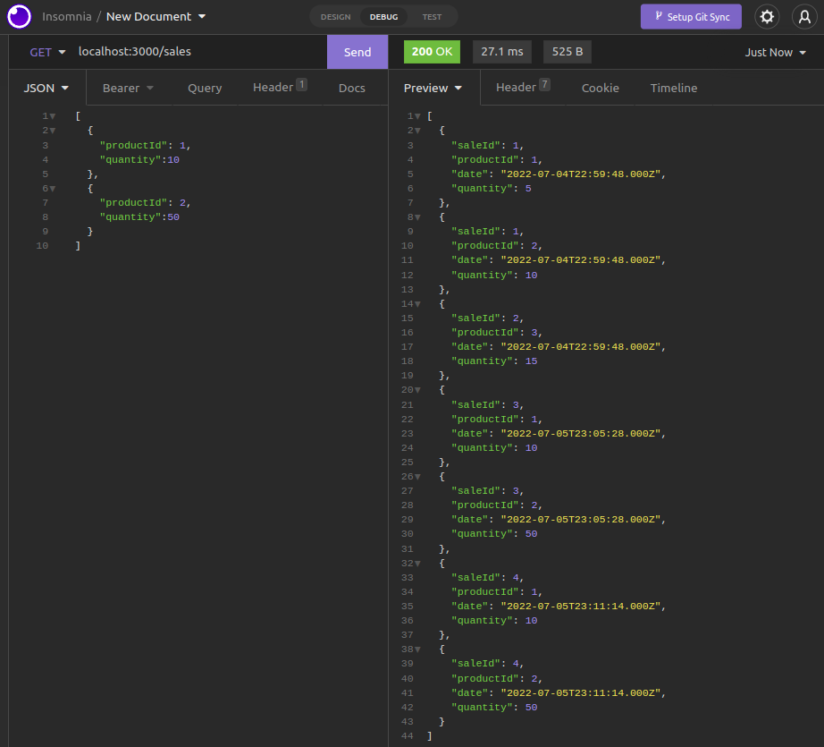

# Projeto Store Manager

Neste projeto, colocamos em prática estilo arquiteturao MSC e o REST API, desenvolvendo uma API com o Express, através do NodeJS. Vale ressaltar que foi o primeiro projeto criado linkando a aplicação com um banco de dados SQL.

Isso significa que podemos Criar (Create), Ler (Read), Atualizar (Update) e Excluir (Delete) quaisquer dados do nosso banco de dados através da API.

Toda aplicação foi feita através do TDD, contendo testes que cobrem 100% do que foi desenvolvido.

---

# Habilidades

- Desenvolver uma API CRUD com o NodeJs utilizando o Express;

- Desenvolver através da metodologia TDD (Test Driven Development);

- Conectar a API com um banco de dados SQL;

- Criar MiddleWares de validação de dados para as requisições;

- Utilizar da arquitetura MSC (Model, Service, Controller) e REST API;

- Utilizar um software (neste caso, o Insomnia) para realizar as requisições.

---

## Requisitos

Ao todo foram 20 requisitos, sendo um 8 deles bônus:
  
#### 1. Crie endpoints para listar produtos;
#### 2. Desenvolva testes que cubram no mínimo 5% das camadas da sua aplicação;
#### 3. Crie endpoint para cadastrar produtos;
#### 4. Crie validações para produtos;
#### 5. Desenvolva testes que cubram no mínimo 10% das camadas da sua aplicação;
#### 6. Crie endpoint para validar e cadastrar vendas;
#### 7. Desenvolva testes que cubram no mínimo 15% das camadas da sua aplicação;
#### 8. Crie endpoints para listar vendas;
#### 9. Desenvolva testes que cubram no mínimo 20% das camadas da sua aplicação;
#### 10. Crie endpoint para atualizar um produto;
#### 11. Desenvolva testes que cubram no mínimo 25% das camadas da sua aplicação;
#### 12. Crie endpoint para deletar um produto.

### Bônus

#### 13. Desenvolva testes que cubram no mínimo 30% das camadas da sua aplicação;
#### 14. Crie endpoint para deletar uma venda;
#### 15. Desenvolva testes que cubram no mínimo 35% das camadas da sua aplicação;
#### 16. Crie endpoint para atualizar uma venda;
#### 17. Desenvolva testes que cubram no mínimo 40% das camadas da sua aplicação;
#### 18. Crie endpoint `products/search?q=searchTerm`;
#### 19. Desenvolva testes que cubram no mínimo 50% das camadas da sua aplicação;
#### 20. Desenvolva testes que cubram no mínimo 60% das camadas da sua aplicação.